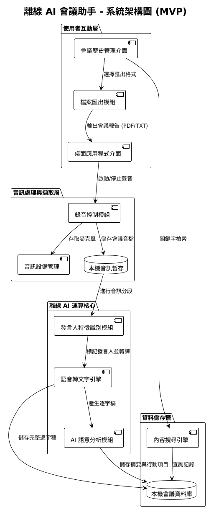

# VoxNote (TRON-MeetingAI)
> **100% 離線運行的 AI 專業會議助手**

VoxNote 是一個為商務與技術開發人員打造的離線 AI 工具，它能錄製、轉錄、並自動校對與產生「具備戰略深度」的會議摘要。所有運算皆在您的本地顯卡上完成，確保數據絕不外流。



---

## ✨ 核心特色 (v1.0.0)
- **極致準確性**: 結合 Faster-Whisper 與 AI 語義校對，自動修正技術名詞與繁體術語。
- **戰略深度摘要**: 捨棄零散條列，提供最少 400 字的核心討論脈絡分析與戰略洞察。
- **隱私至上**: 無須網路連接，AI 核心、資料庫與音訊檔案完全保存在您的硬碟中。
- **專業 PDF 匯出**: 一鍵產生排版精美的「專家分析報告」，且預設儲存於您的專案目錄。

---

## 🛠️ 系統環境要求 (重要)
在使用前，請確保您的設備符合以下規格：
- **作業系統**: Windows 11 (64-bit)
- **顯示卡**: NVIDIA GPU (強烈建議 **8GB+ VRAM**, 如 RTX 3060/4060 Ti 以上)
- **軟體環境**: CUDA 12.4 + Python 3.13 + Visual Studio 2026 Build Tools
- **磁碟空間**: 建議預留 20GB 以上（供模型與編譯暫存使用）

---

## 🚀 極速啟動五步驟

### 1. 建立 Python 環境
```cmd
python -m venv venv
venv\Scripts\activate
pip install -r sidecar/requirements.txt
```

### 2. 初始化前端與資料庫
```cmd
npm install
npx prisma db push
```

### 3. 下載 AI 模型
請下載以下模型並放入 `models/` 資料夾（詳見 [AI 模型下載與配置](#-ai-模型下載與配置)）：
- `Systran/faster-whisper-large-v3-turbo`
- `Llama-3-Taiwan-8B-Instruct-v1-GGUF`

### 4. 設定環境變數
複製 `.env.example` 為 `.env` 並填入您的設定（特別是 `HF_TOKEN`）。

### 5. 啟動應用程式
```cmd
npm run dev
```

---

## 🧠 AI 模型下載與配置

### 1. 語音轉文字 (STT) - Faster Whisper
推薦使用 `large-v3-turbo`，平衡了速度與精確度。
- **下載連結**: [HuggingFace - Systran/faster-whisper-large-v3-turbo](https://huggingface.co/Systran/faster-whisper-large-v3-turbo)
- **存放路徑**: `models/whisper/`

### 2. 會議分析與潤飾 (LLM) - GGUF 格式
我們採用 **「雙引擎聯動」** 策略，建議下載以下兩個模型：
- **邏輯引擎 (事實提取)**: [Qwen2.5-7B-Instruct-GGUF](https://huggingface.co/Qwen/Qwen2.5-7B-Instruct-GGUF) (建議 `Q4_K_M` 版本)。
- **潤飾引擎 (繁中商務)**: [Llama-3-Taiwan-8B-Instruct-v1-GGUF](https://huggingface.co/yentinglin/Llama-3-Taiwan-8B-Instruct-GGUF) (建議 `Q4_K_M` 版本)。

### 3. 發言人辨識 (Speaker Diarization)
- **授權申請**: 前往 [pyannote/speaker-diarization-3.1](https://huggingface.co/pyannote/speaker-diarization-3.1) 接受協議。
- **Token 配置**: 在應用程式「設定」頁面填入您的 HuggingFace Access Token。

---

## ❓ 常見問題 (FAQ)

#### Q: 只有 6GB 顯存 (VRAM) 的顯卡可以執行嗎？
A: 可以，但建議在「設定」中將 LLM 顯存層數 (n_gpu_layers) 適度調低（例如 20-30 層），或使用更輕量化的模型版本 (如 Q4_K_S)。

#### Q: 為什麼 PDF 匯出路徑與我想的不一樣？
A: v1.0.0 已優化：匯出預設會開啟您在 Settings 中設定的 **Storage Path**。若未設定，則預設回退至桌面。

#### Q: 我可以增加自定義的專業術語嗎？
A: 可以！在「設定」頁面的「自定義術語」中填入關鍵字（如公司產品名、內部代號），AI 會在轉錄與校對時優先識別。

#### Q: Sidecar 狀態顯示紅色 "OFFLINE" 怎麼辦？
A: 請確認 8000 埠號未被佔用，或嘗試執行根目錄的 `REPAIR_GPU.bat` 清理殘留進程。

---

## 🛠️ 開發者工具箱
| 腳本名稱 | 核心功能 |
| :--- | :--- |
| **`REPAIR_GPU.bat`** | 一鍵清理殘留進程、重設 CUDA 環境變數。 |
| **`DEVELOPER_SHORT_PATH_BUILD.bat`** | 繞過 Windows 260 字元路徑限制進行編譯。 |
| **`DEVELOPER_ULTIMATE_BUILD.bat`** | **自動發佈流程**：Prisma 生成 -> Sidecar 打包 -> Electron 封裝。 |

---

## 🛡️ 隱私與安全
- **100% 離線**: 核心邏輯完全不依賴外部 API。
- **憑證安全**: HuggingFace Token 使用 `safeStorage` 系統級加密儲存。
- **授權協定**: MIT License.

---
Copyright (c) 2026 Yunotang (ashtontron). All rights reserved.
